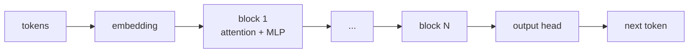
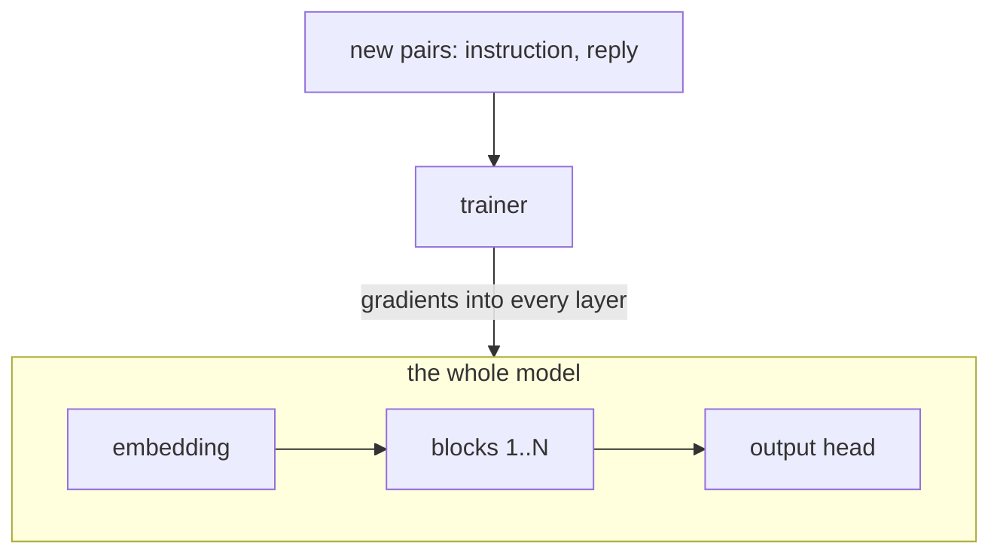
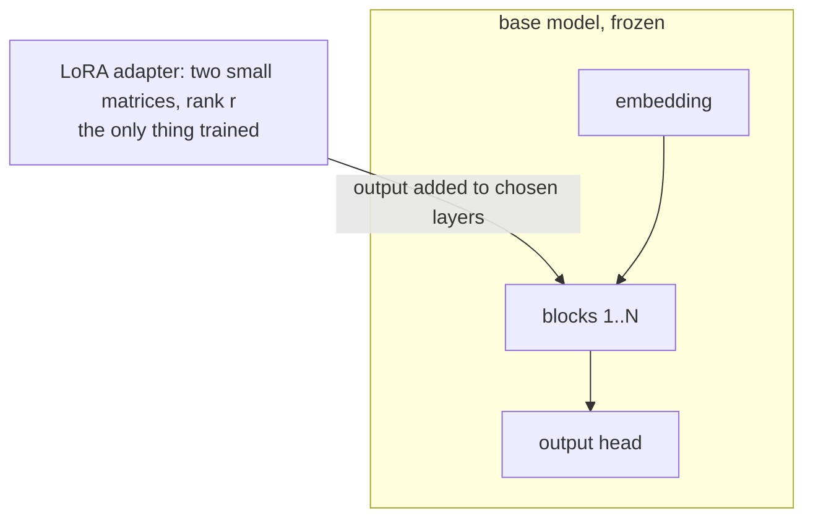
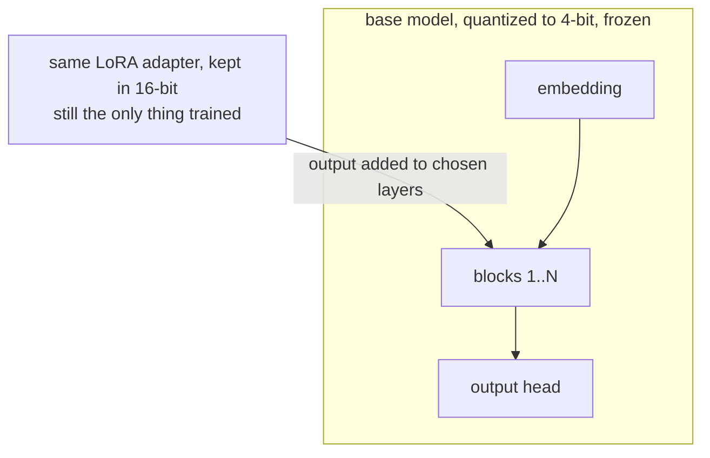

<div class="part-number">5</div>
<div class="part-title">Technical reference</div>
<div class="part-sub">Modular. The default path covers some of this on the
whiteboard or in the notebook instead.</div>

<!--
TIMING: 10 seconds.
SAY: This section exists for the room that wants the mechanics. If time runs short it drops; the notebook contains the details and stands on its own.
CLICK: none.
SOURCE: none.
CUT: the whole section, if time runs short.
FALLBACK: static.
-->

---
footer: false
---

# A transformer, ruthlessly simplified

<p class="method-intro">
Tokens go in, pass through a stack of identical blocks, and the head predicts
the next token. Attention decides which earlier tokens matter; the MLP decides
what to make of them.
</p>



<p v-click class="reserve method-punch">
Every arrow is a matrix of learned weights. Training changes matrices. The
three methods that follow differ only in which ones.
</p>

<style>
.method-intro {
  max-width: 44rem;
  font-size: 1rem;
  color: var(--ink-soft);
}
.method-punch {
  margin-top: 1rem;
  font-size: 1.15rem;
  font-weight: 600;
}
</style>

<!--
TIMING: 60 seconds.
SAY: This is the whole architecture at the resolution we need today. Billions of numbers arranged as matrices; a forward pass is multiplication. The click lands the setup for the next three slides: methods differ only in which matrices get to change.
CLICK: 1. The punch line.
SOURCE: standard decoder-only transformer, simplified past recognition on purpose.
CUT: compress to 20 seconds for an ML-heavy room.
FALLBACK: static diagram, renders offline.
-->

---
footer: false
---

# Full fine-tuning updates everything

<p class="method-intro">
New pairs, the same or a new instruction format, and gradients flow into every
layer. The whole model moves toward the new behavior.
</p>



<div class="method-facts">
  <span>updates all weights, about 2B for our Gemma</span>
  <span>needs optimizer state for every one of them</span>
  <span>ships a whole new checkpoint</span>
</div>

<style>
.method-intro {
  max-width: 44rem;
  font-size: 1rem;
  color: var(--ink-soft);
}
.method-facts {
  display: flex;
  gap: 2rem;
  margin-top: 1rem;
  border-top: 2px solid var(--rule);
  padding-top: 0.6rem;
  font-family: "IBM Plex Mono", monospace;
  font-size: 0.78rem;
  color: var(--ink-soft);
}
</style>

<!--
TIMING: 45 seconds.
SAY: The most capable and the most expensive option. Every weight can move, so it needs the most memory and the most data, and the result is a full copy of the model. Catastrophic forgetting lives here too: everything can move, so everything can drift.
CLICK: none; one idea, one diagram.
SOURCE: standard supervised fine-tuning; the parameter count is Gemma 4 E2B's, rounded.
CUT: never if this section runs; the next two slides are defined relative to this one.
FALLBACK: static diagram, renders offline.
-->

---
footer: false
---

# LoRA freezes the base and trains a detour

<p class="method-intro">
The base weights never change. Two small matrices attach next to chosen
layers, their product is added to the output, and only they are trained. They
steer the frozen model toward the behavior in the pairs.
</p>



<div class="method-facts">
  <span>base untouched, no forgetting in it</span>
  <span>roughly 1% of the weights train</span>
  <span>ships an adapter file, megabytes</span>
</div>

<style>
.method-intro {
  max-width: 44rem;
  font-size: 1rem;
  color: var(--ink-soft);
}
.method-facts {
  display: flex;
  gap: 2rem;
  margin-top: 1rem;
  border-top: 2px solid var(--rule);
  padding-top: 0.6rem;
  font-family: "IBM Plex Mono", monospace;
  font-size: 0.78rem;
  color: var(--ink-soft);
}
</style>

<!--
TIMING: 60 seconds.
SAY: Low-Rank Adaptation. Instead of moving a huge matrix, add a small correction beside it and train only the correction. The adapter can be shipped alone, swapped, or merged into the base later. This is the LoRA the image and video slides kept mentioning.
CLICK: none; one idea, one diagram.
SOURCE: Hu et al. 2021; adapters commonly attach to the attention projections, chosen per config.
CUT: never if this section runs.
FALLBACK: static diagram, renders offline.
-->

---
footer: false
---

# QLoRA is LoRA on a compressed base

<p class="method-intro">
Same detour, but the frozen base is first quantized to 4-bit. The adapter
stays in higher precision and trains exactly as before. Quality drops a
little; memory drops a lot.
</p>



<div class="method-facts">
  <span>base compressed about 4x in memory</span>
  <span>same adapter, same training loop</span>
  <span>fits on a laptop GPU</span>
</div>

<div class="provenance">
this is the workshop path: just chess-adapt runs QLoRA on Gemma 4
</div>

<style>
.method-intro {
  max-width: 44rem;
  font-size: 1rem;
  color: var(--ink-soft);
}
.method-facts {
  display: flex;
  gap: 2rem;
  margin-top: 1rem;
  border-top: 2px solid var(--rule);
  padding-top: 0.6rem;
  font-family: "IBM Plex Mono", monospace;
  font-size: 0.78rem;
  color: var(--ink-soft);
}
</style>

<!--
TIMING: 45 seconds.
SAY: The Q buys memory: quantize the frozen base to 4-bit, keep the adapter in 16-bit, and the whole thing fits on hardware people actually own. That trade is why the workshop trainer uses it.
CLICK: none; one idea, one diagram.
SOURCE: Dettmers et al. 2023; the workshop runs Unsloth QLoRA on google/gemma-4-E2B-it-qat-q4_0-unquantized via just chess-adapt.
CUT: never if this section runs; it names the exact path the room will use.
FALLBACK: static diagram, renders offline.
-->

---
clicks: 5
---

# The recipe

<ModalityGrid :clicks="$clicks" />

<!--
TIMING: 90 seconds.
SAY: Pairs in, adapter out, eval always. Say the mantra out loud; it returns at the close with the same words.
CLICK: 5. One modality row per click, then the mantra.
SOURCE: adapters and evals as configured in the workshop; the grid keeps the fixed row and column order it has everywhere.
CUT: never if this section runs.
FALLBACK: static.
-->

---
clicks: 5
---

# One move, six honest rows

<DatasetShapes :clicks="$clicks" />

<!--
TIMING: 2 minutes.
SAY: Encoding is a design decision. Each shape trains a different model. The tensor class 3980 is e2e4 under the from times 320 plus to times 5 plus promotion vocabulary, and it inverts back to the move.
CLICK: 5. The five clicks step from the PGN prefix shape through the RL trajectory.
SOURCE: shapes match docs/datasets.md and the phase 33 corrections.
CUT: shapes four to six compress to one beat for a non-ML room.
FALLBACK: static data, no dependencies.
-->

---

# The environment's feedback

<RewardMeter />

<p class="feedback-note">
A model reply that is illegal never moves the board. The environment applies a
labelled fallback and the failure lands in the eval as part of the model
legal-move rate.
</p>

<style>
.feedback-note {
  max-width: 36rem;
  margin: 1rem auto 0;
  font-size: 0.9rem;
  color: var(--ink-soft);
}
</style>

<!--
TIMING: 90 seconds.
SAY: Environment feedback is separate from model output. python-chess knows the rules; this function knows what they are worth. Press the outcomes; the return accumulates.
CLICK: none; the meter is presenter-pressed, and remounting resets it to idle.
SOURCE: participant rewards as implemented on the board. Model-side illegal replies use the phase 33 fallback semantics stated on the slide.
CUT: the pressing demo; the numbers read statically.
FALLBACK: static component, no backend.
-->

---

# Prompt, chat template, constrained reply

<div class="code-lg">

````md magic-move
```python
PROMPT_TEMPLATE = """You are a chess engine assistant.

Position (FEN): {fen}
Legal moves (UCI): {legal_moves}

Return exactly one move from the legal moves list.
Respond with JSON: {{"move": "<uci>"}}"""
```

```python
# The tokenizer owns the turn format; we never write it by hand.
from transformers import AutoProcessor

processor = AutoProcessor.from_pretrained(
    "google/gemma-4-E2B-it-qat-q4_0-unquantized")

rendered = processor.apply_chat_template(
    [{"role": "user", "content": prompt},
     {"role": "assistant", "content": '{"move": "e2e4"}'}],
    tokenize=False)
```

```text
<bos><|turn>user
Position (FEN): rnbqkbnr/pppppppp/8/8/...
Legal moves (UCI): e2e4, d2d4, g1f3, ...
Return exactly one move...<turn|>
<|turn>model
{"move": "e2e4"}<turn|>
```
````

</div>

<!--
TIMING: 90 seconds.
SAY: Three forms of the same intent: the raw prompt, the render call, the rendered turns. The turn markers come from the Gemma 4 tokenizer, not from us; earlier Gemma versions used different markers, which is exactly why rendering is delegated to apply_chat_template. The tokenizer sees the third form. Most fine-tuning bugs live between step one and step three. At inference the same call takes add_generation_prompt=True and stops after the opened model turn.
CLICK: 2. Prompt morphs into the render call, which morphs into its rendered output.
SOURCE: turn markers per the selected Gemma 4 tokenizer's chat template; render shown is the apply_chat_template output for this pair.
CUT: never if this section runs.
FALLBACK: static code, no dependencies.
-->

---
clicks: 2
---

# Base and adapted, one frozen suite

<OutcomeCompare :clicks="$clicks" />

<!--
TIMING: 90 seconds.
SAY: Matched inputs, two checkpoints, the same frozen evaluation suite. These are authored replay fixtures, not a training run. Legality and JSON validity improve in the script; explanation rate falls. The panel shows both the trade and the provenance.
CLICK: 2. The base column, then the adapted column with deltas and the regression row.
SOURCE: phase 34 scripted replay, sft-v2 suite a274c01d640a346e. No model was trained and no provider produced these replies.
CUT: never if this section runs; this is the honest-evaluation beat.
FALLBACK: the fixture is committed and keyless.
-->

---

# The training ladder

<div class="ladder-intro">One dataset, three of the five rungs as abbreviated
implementation shapes. Deploy:
<code>google/gemma-4-E2B-it-qat-q4_0-gguf</code>. Tune:
<code>google/gemma-4-E2B-it-qat-q4_0-unquantized</code>.</div>

<div class="code-lg">

````md magic-move
```python
# Rung 4: code that reads like config (Unsloth)
from unsloth import FastModel
from trl import SFTConfig, SFTTrainer

model, tok = FastModel.from_pretrained(
    "google/gemma-4-E2B-it-qat-q4_0-unquantized",
    load_in_4bit=True)
model = FastModel.get_peft_model(model, r=8, lora_alpha=8)
```

```yaml
# Rung 3: the run is a file (axolotl)
base_model: google/gemma-4-E2B-it-qat-q4_0-unquantized

adapter: lora
lora_r: 16
chat_template: gemma4
# Gemma 4 loads as multimodal even for text-only training
freeze_mm_modules: true
datasets:
  - path: data/processed/text/chess_sft.jsonl
```

```python
# Rung 5: no trainer, no config, just the loss (JAX)
import jax
import jax.numpy as jnp

def loss_fn(adapter, frozen_base, batch):
    delta = adapter["a"] @ adapter["b"]
    logits = batch["hidden"] @ (frozen_base + delta)
    return -jnp.mean(jax.nn.log_softmax(logits)[
        jnp.arange(batch["target"].shape[0]), batch["target"]])

loss, grads = jax.value_and_grad(loss_fn)(adapter, frozen_base, batch)
```
````

</div>

<style>
.ladder-intro {
  font-size: 0.8rem;
  color: var(--ink-soft);
  margin-bottom: 0.6rem;
}
</style>

<!--
TIMING: 2 minutes.
SAY: The same run's shape at three levels of abstraction: Unsloth code, an axolotl file, the bare JAX loss. These are abbreviated implementation shapes, not complete scripts; the runnable version of rung five executes in the notebook. The GGUF is for deployment; training starts from the unquantized weights and the merged result converts back. Gemma 4 loads as a multimodal model even for text-only training, hence the frozen multimodal modules in the axolotl file.
CLICK: 2. Unsloth morphs into the axolotl file, which morphs into the JAX loss.
SOURCE: model ids are the accepted ones; the axolotl path points at the real dataset file and follows current axolotl Gemma 4 guidance. All three frames are deliberately abbreviated.
CUT: skippable when the notebook carries the ladder.
FALLBACK: static code, no dependencies.
-->

---

# The whole ladder

| rung | surface | what it costs you |
| --- | --- | --- |
| 1. UI | Unsloth Studio, live loss curves | no code, least control |
| 2. API | a training endpoint | your data leaves the room |
| 3. config | axolotl, the run is a YAML file | one file to review |
| 4. code | Unsloth, five lines | one GPU |
| 5. loss | raw JAX, trains in the notebook | everything is yours to break |

<!--
TIMING: 45 seconds.
SAY: The full ladder in one frame. You saw rungs three, four, and five as real code on the previous slide; the notebook runs rung five live on CPU.
CLICK: none; the rungs are compared at once.
SOURCE: same as the previous slide.
CUT: skippable with the previous slide.
FALLBACK: static.
-->

---

# Image, audio, video: what changes

| modality | pairs | eval | typical failure |
| --- | --- | --- | --- |
| image | (image, caption) | VLM judge: identity, style | style drifts across the set |
| audio | (text, audio) | duration, clipping, spectrogram | silence, clipping at the rails |
| video | (Luna scene, clip) | case adherence, continuity | object flicker, lost case |

<p class="statement-quiet">
The recipe holds. The pairs, the failure modes, and the evaluation change.
</p>

<!--
TIMING: 90 seconds.
SAY: Same recipe, different data shapes, different failure modes, different evals. This is the whole comparison in one table.
CLICK: none; the rows are compared at once.
SOURCE: evals as implemented in the workshop backend and notebook.
CUT: skippable when the modality pages on the board carry it.
FALLBACK: static.
-->

---
clicks: 2
---

# Merging, and what it can damage

<div v-click="1" class="reserve">

```yaml
merge_method: slerp
models:
  - model: gemma-4-chess-moves
  - model: gemma-4-chess-commentary
base_model: gemma-4-chess-moves
parameters:
  t: 0.5
dtype: bfloat16
```

</div>

<p v-click="2" class="reserve statement-quiet">
Sometimes you get both skills. Sometimes you get neither. The check is the
same as everywhere else in this session: eval before you believe.
</p>

<!--
TIMING: 90 seconds.
SAY: Two fine-tuned checkpoints, one merged model, a YAML file. mergekit slerp works on full checkpoints; merging at the adapter level goes through PEFT instead. Merging can also damage both skills, which is why the frozen suite runs again after every merge.
CLICK: 2. The mergekit config, then the caution.
SOURCE: valid mergekit slerp config over the two merged workshop checkpoints, matching mergekit's official gradient-slerp.yml example. The top-level `models:` form lists both full checkpoints and needs no per-source layer_range; `slices:` is the form for partial or layer-by-layer merges, and every source under it requires layer_range (mergekit/config.py InputSliceDefinition).
CUT: skippable.
FALLBACK: static.
-->

---
clicks: 1
---

# Take it home

<div class="takeaway">

- The repo: board, deck, notebook
- The notebook: `just session-notebook`
- Your dataset: the export file is yours
- Unsloth, axolotl, mergekit, verifiers, fal: linked in the notebook

</div>

<div v-click class="reserve mantra">
Pairs in. Adapter out. Eval always.
</div>

<p class="thanks">Thank you.</p>

<style>
.takeaway {
  max-width: 30rem;
}
.mantra {
  margin-top: 2rem;
  font-size: 1.7rem;
  font-weight: 700;
}
.thanks {
  margin-top: 1.6rem;
  color: var(--ink-soft);
}
</style>

<!--
TIMING: 60 seconds, then Q&A with the slide up.
SAY: Everything survives the session: the repo, the notebook, the dataset each participant exported.
CLICK: 1. The mantra, said the same way as in the recipe slide.
SOURCE: repo URL and QR pending from Ramon; add to the placeholder inventory when supplied.
CUT: never.
FALLBACK: static.
-->
