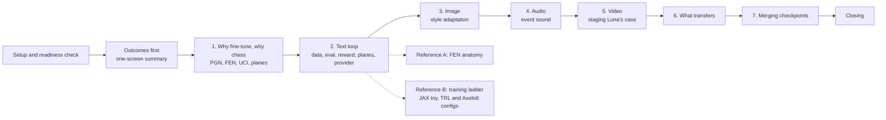

# Notebook architecture: `notebooks/full-session3.py`

Evaluation of the standalone workshop notebook (1921 lines, jupytext
percent format). What it is, how the parts connect, and what to fix
before showtime.

## What it is

One file, two jobs. A presenter script for the closing session and a
reference document learners can rerun later. The spine is a small chess
dataset built once with python-chess; every modality section hangs off
that spine. The default run is fully offline: deterministic fixtures and
synthesised media stand in for adapter outputs and provider calls, and
each stand-in is labelled as such.

## Reading order

The presenter path is the outcome table, sections 2 to 6, and the
closing. Reference cells are safe to skip live.

## How the pieces interact

Everything derives from four games replayed through python-chess. The
split is by game, so near-duplicate positions never leak across train
and eval. Provider access funnels through a single function, which is
what keeps the retry policy auditable.

```mermaid
flowchart TB
    subgraph S0["0. Setup"]
        HELPERS["Display helpers<br/>show_markdown, show_table, indented"]
        CONST["Constants<br/>REPO_ROOT, Gemma ids, VIDEO_PROMPT_MODEL"]
        READINESS["Readiness table<br/>packages, optional API keys"]
    end

    subgraph SPINE["Chess data spine, sections 1 to 2"]
        LIB["GAME_LIBRARY<br/>four games as SAN tuples"]
        REPLAY["replay_game<br/>validates each SAN, records every ply"]
        RECORDS["ReplayedGame<br/>PGN plus one MoveRecord per ply:<br/>fen before and after, uci, legal moves, flags"]
        SPLIT{"Split by game"}
        TRAIN["TRAIN_RECORDS<br/>26 plies, three openings"]
        EVALR["EVAL_RECORDS<br/>4 plies of fools-mate"]
        LIB --> REPLAY --> RECORDS --> SPLIT
        SPLIT --> TRAIN
        SPLIT --> EVALR
    end

    subgraph TEXT["2. Text: one complete adaptation loop"]
        PROMPT["position_prompt<br/>FEN plus legal moves plus JSON contract"]
        ROWS["canonical_row, prompt_completion_row<br/>durable record vs trainer view"]
        JSONL["Trainer JSONL, temp dir"]
        CASES["EVALUATION_CASES"]
        PARSE["parse_json_object, parse_move_reply"]
        EVALFN["evaluate_predictions<br/>JSON rate, parse rate, legality,<br/>reference agreement, mate-in-one"]
        FIXT["BASELINE_FIXTURE vs ADAPTED_FIXTURE<br/>deterministic stand-ins"]
        CHART["Metrics tables plus bar chart"]
        REWARD["score_transition<br/>illegal penalty, terminal reward, check shaping"]
        PLANES["board_planes, 18x8x8<br/>advanced_targets"]
        TRAIN --> PROMPT --> ROWS --> JSONL
        TRAIN --> PLANES
        EVALR --> CASES --> EVALFN --> CHART
        FIXT --> EVALFN
        PARSE --> EVALFN
        CASES --> REWARD
    end

    subgraph LIVE["Optional provider path, offline by default"]
        ERRMSG["response_error_message"]
        RETRY["should_retry_response<br/>429 and 5xx, or the one observed<br/>generic 401 after a success or new key"]
        CHAT["llm_chat<br/>chat completions, three attempts, backoff,<br/>drops JSON mode on a 400"]
        DRAFT["draft_video_scenario<br/>game to real-world case to LTX prompt"]
        RUNEVAL["run_live_text_evaluation"]
        COMPARE["compare_chess_models<br/>local Gemma vs Luna on the mate-in-one"]
        ERRMSG --> RETRY --> CHAT
        CHAT --> DRAFT
        CHAT --> RUNEVAL
        CHAT --> COMPARE
    end

    subgraph MEDIA["3 to 5. Image, audio, video worked stand-ins"]
        IMG["Caption rows, drawn base vs style panels<br/>evaluation plan, recipe table"]
        AUD["synthesize_capture, wav_bytes<br/>audio_signal_metrics, recipe table"]
        VIDFIX["VIDEO_SCENARIO_FIXTURE<br/>offline contract for a saved Luna reply"]
        VID["make_video_fixture GIFs<br/>subject_color_consistency, recipe table"]
        VIDFIX --> VID
    end

    subgraph CLOSE["6 to 7, plus reference appendix"]
        TRANSFER["TRANSFER_TABLE<br/>which decisions repeat"]
        MERGE["MERGEKIT_CONFIG<br/>SLERP for two compatible text checkpoints"]
        FENREF["Reference A: FEN anatomy"]
        LADDER["Reference B: checkpoints, training ladder"]
        JAXT["Direct JAX LoRA toy<br/>frozen base plus low-rank adapter"]
        CFGS["Printed TRL and Axolotl configs"]
    end

    READINESS -. "no keys, stays offline" .-> CHAT
    RECORDS -. "fools-mate PGN and final FEN" .-> DRAFT
    CASES -. "commented-in live run" .-> RUNEVAL
    RUNEVAL -. "same scoring" .-> EVALFN
    CASES -. "last case, mate in one" .-> COMPARE
    DRAFT -. "saved reply replaces fixture" .-> VIDFIX
    TRAIN -. "features and labels" .-> JAXT
    PLANES -. "feature encoder" .-> JAXT
    JSONL -. "dataset path" .-> CFGS
```

## The five arcs worth understanding

1. **One game, many views.** `replay_game` is the only place chess
   knowledge lives. `MoveRecord` is the durable row; trainer formats,
   evaluation cases, plane features, and prompts are all derived views.
   Nothing downstream re-parses PGN.
2. **Fixtures first, live later.** Every measured-looking table is a
   deterministic fixture until a commented-in call replaces it. The
   evaluation code never changes between fixture and live runs, which
   is the actual lesson of section 2.
3. **Worked stand-ins, not evidence.** The image panels, audio clips,
   and video GIFs are synthesised locally to make the target contract
   visible. Each carries a label saying so.
4. **One door for providers.** `llm_chat` owns transport, retries, JSON
   mode fallback, and request-id diagnostics. The narrowly scoped 401
   retry (`should_retry_response`) matches the project rule: only the
   exact observed generic permissions message, only after a success or
   a fresh key.
5. **The appendix reuses the spine.** The JAX toy trains on
   `board_planes` features of `TRAIN_RECORDS`, and the printed trainer
   configs point at the JSONL written earlier. Reference cells are not
   a separate world.

## What is genuinely good

Keep these. Split by game, not by move. Canonical rows separate from
trainer views, so an Axolotl field name never becomes the data model.
The fixture evaluation that distinguishes invalid JSON, illegal moves,
legal alternatives, the reference move, and mate in one. Honest labels
on every stand-in. The bounded 401 retry with request ids in the error.
Reward shaping presented as a trap, not a trick.

## Suggestions

Ordered by payoff per line changed.

### Fix before the workshop

1. **`show_table` lies about its return type** (L82-85). Annotated
   `-> pd.DataFrame`, but `return frame` is commented out. Restore the
   return; learners will want the frame.
2. **Dead SVG calls** (L219-223, L357-360). The `display(SVG(...`
   wrappers are commented out, so `chess.svg.board(...)` executes and
   the result is discarded. Show the board (it is the one picture
   everyone wants at that moment) or delete the call.
3. **Placeholder copy** (L209). "Quote the art of war here" is still in
   the prose. Fill it or cut it.
4. **Vestigial `FAL_KEY` row** (L117). No fal call exists in this file;
   fal lives in the older `full-session.py`. Drop the readiness row or
   the notebook advertises a capability it never uses.
5. **Brittle JSON extraction** (L487-498). `chr(96) * 3` is a cute way
   to avoid typing three backticks, and the fence is only stripped if
   it wraps the whole reply. Models love surrounding JSON with prose. A
   first-`{`-to-last-`}` fallback is two lines and will save a live
   demo. If the brittleness is itself the lesson, say so in the prose.
6. **Silent sentinel in `compare_chess_models`** (L1096). Gemma gets
   `reasoning_effort=""`, which works only because `llm_chat` drops
   falsy values before building the body. One comment line, or pass an
   explicit sentinel. A learner who "tidies" the empty string to `None`
   silently gets the env default of `medium` sent to a local endpoint
   that may reject it.

### Structure

7. **One live toggle.** The provider path is three separate commented
   lines (L1109-1114). A single `LIVE = os.environ.get("FTSHOP_LIVE") == "1"`
   with `if LIVE:` blocks keeps the offline default, removes
   edit-the-source steps mid-demo, and makes the opt-in surface visible
   in one place.
8. **The move prompt exists three times** (L390-397, L1002-1007,
   L1049-1054). The live eval and the comparison rebuild by hand what
   `position_prompt` already builds. Derive all three from one builder
   so the live run measures the same contract the training rows teach.
   Train-prompt and eval-prompt drift is a classic silent failure; the
   notebook should model the hygiene it preaches.
9. **The recipe tables are one shape, written four times** (L1224,
   L1349, L1537, L1571). A small `recipe_table(modality, rows)` helper,
   with `TRANSFER_TABLE` rows generated from the four recipes, makes it
   impossible for the closing summary to drift from the sections it
   summarises.
10. **The presenter path is prose, not metadata.** The intro names it,
    but no cell carries it. Cell tags or a marker in section headers
    would let you extract the demo subset mechanically from a 1921-line
    file.
11. **`draft_video_scenario` returns less than its own schema**
    (L783-791 vs L979-991). The schema and the fixture carry
    `label_source`, `reviewed`, and provenance; the live path returns
    only the three reply fields. Assemble the full row
    (`label_source="model draft"`, `reviewed=False`) so swapping the
    fixture for a saved Luna response is drop-in, and the schema stops
    being decorative.
12. **Ephemeral trainer path in durable-looking configs** (L419,
    L1851-1900). The JSONL is written to the temp dir, and the printed
    TRL and Axolotl configs embed that path. After a reboot the configs
    point at a missing file. Persist the JSONL somewhere durable or
    render the config path as an obvious placeholder.

### Teaching payoff

13. **The JAX toy never faces held-out data** (L1757-1848). Worse, and
    better: the eval target `d8h4` is not in `JAX_MOVE_VOCAB`, so the
    toy cannot even name the right answer. That is the most instructive
    fact in the reference section and it is currently invisible. One
    cell reporting train accuracy, eval accuracy, and the
    out-of-vocabulary count turns "loss goes down" into "loss goes down
    and it still cannot play."
14. **Unexplained constant** (L1509-1511). `subject_color_consistency`
    divides channel variation by 128 with no comment. Name it, or say
    it is a hand-picked normaliser for this fixture and not a
    meaningful unit.
15. **The `_CHAT_HAS_SUCCEEDED` global is invisible state** (L820,
    L858, L917). Whether a 401 gets retried depends on whether this
    process has ever succeeded. Log a warning the first time the global
    unlocks a 401 retry, so a confused learner can see why a retry
    happened.
16. **Optional: make the expensive audio check concrete.** Duration,
    clipping, and RMS get computed numbers; the CLAP similarity check
    gets a sentence. One fixture row showing what a CLAP-style score
    looks like keeps "expensive check" as tangible as the cheap ones.
